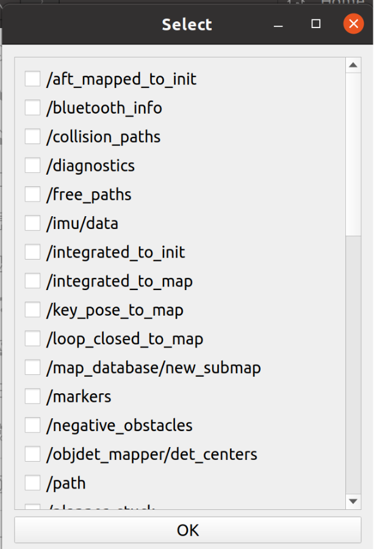

# subt_toolkit
## Introduction
This is a GUI interface for filtering according to topic and time as well as detecting path length and whether returning to the starting point.   
Each time this GUI processes all files (which must be rosbags) under the directory given by the user, considering these files as components of one complete running task of nuc or uav robot. This software first filters all rosbags and then computes the path length and the ending status of this one whole task.

## Usage and Function Description
### Installation and Run
1. This repository contains two ROS packages. Create one ROS workspace on your own computer and move these two packages into this workspace.
2. Compile this workspace
3. Run the software:
```
  source devel/setup.bash
  rosrun rosbag_filter_gui rosbag_filter_gui.py
```

### Operate and Get the Results
1. At first, one hint tells the user the software starts successfully:
2. One window will pop out. Users should select the first file under the required directory which contains all rosbags of one task. All the files under the given directory must be rosbags. 
In this window, all the files under /media/muhanlin/Elements/R1_922_nuc will be selected after the user clicking "Open".    
Then the program displayed the names of selected files in the terminal and start to filter them one by one. 
3. The second window pops out to ask the user to select the reserved topics. Drag the sliding bar to select all required topics and click "OK".    
   
Then the program displays the names of all selected topics and starts filtering. We can see the progress of filter from the progress bar.    
   
The format of the progress bar is: num_of_processed_msgs/total_num_of_msgs [current_elapsed_time<remaining_time, num_of_msgs/s]   
Sometimes one error is reported, but it does not influence the result.      
The program works like this repeatedly to filter out all given rosbags.
4. After completing filtering, the program starts to compute path length and the ending status automatically if the user click "OK" in the message window.    
   
The calculation is completed while playing the rosbags. We can see the progress messages in the terminal, outputted by roslaunch. After completing playing one rosbag, it will take about 20 seconds to terminate the processing node and record the data. The path length and displacements of the current single bag are not only displayed in the terminal, but also stored in txt files named after this single bag under the home directory of ros. After the process work of all bags completed, the total path length and whether the robot returns to the startng point finally will be shown by message window and stored in result.txt under the home directory of ros.   
   

## Visualization
I recommend you to use rviz or the following tool to check the path encoded in rosbags.   
[visualization tool]: https://github.com/facontidavide/PlotJuggler

## Reference
[1]: https://github.com/AtsushiSakai/rosbag_filter_gui      
[2]: https://github.com/tqdm/tqdm
